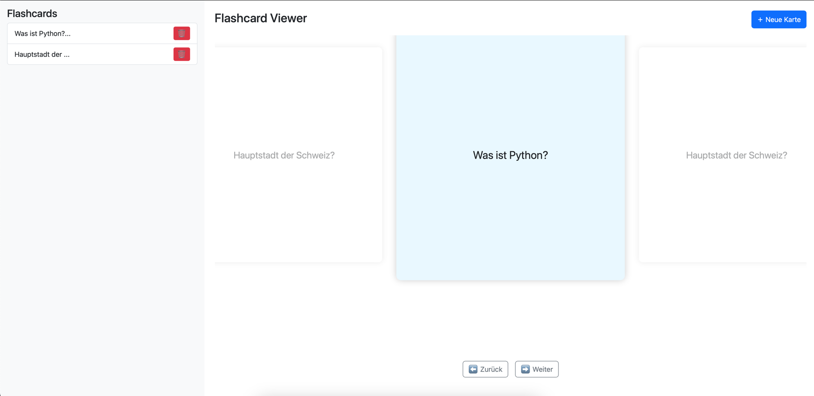
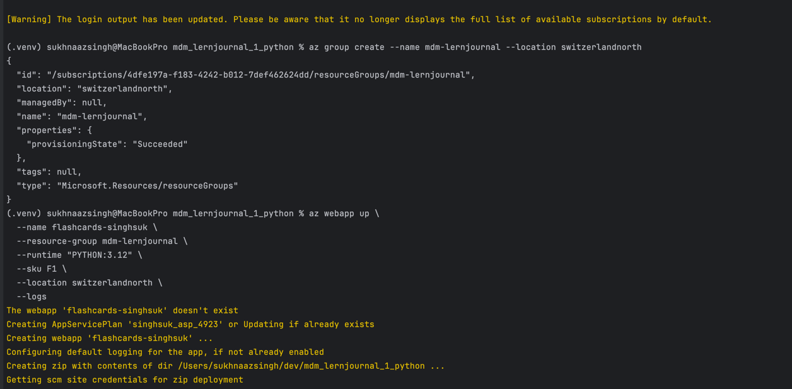

# Lernjournal 1 

## 🔗 Repository

| | |
|--|--|
| **Repository (URL)** | [https://github.com/sukhnaazsingh/mdm_lernjournal_1_python.git](https://github.com/sukhnaazsingh/mdm_lernjournal_1_python.git) |
| **Kurze Beschreibung** | Eine einfache Web-App zur Verwaltung von Lernkarten (Flashcards) – inkl. Hinzufügen, Löschen und Blättern im Carousel-Stil |

---

## 🧠 Projektidee & Ziel

Ziel des Projekts war es, eine interaktive Lernkarten-App mit Python und Flask zu entwickeln. Die Anwendung ermöglicht es Nutzer:innen, Lernkarten dynamisch zu erstellen, zu löschen und durch ein ansprechendes Frontend zu navigieren. Durch das moderne Carousel-Layout mit einer Flip-Funktion ist das Interface übersichtlich und intuitiv gestaltet.

---

## ⚙️ Funktionen im Überblick

| Funktion                 | Beschreibung |
|--------------------------|--------------|
| Karten anzeigen          | Flashcards werden als zentrales Karussell mit Sneak-Peek links/rechts angezeigt. |
| Karten hinzufügen        | Über ein HTML-Formular lassen sich neue Karten erstellen (Vorder-/Rückseite). |
| Karten löschen           | Jede Karte kann über einen Button entfernt werden. |
| Karten umdrehen (flip)   | Die mittlere Karte kann durch Klick umgedreht werden, um die Rückseite anzuzeigen. |
| Navigation               | Durch Buttons kann zwischen den Karten geblättert werden. |

---

## 🧩 Technischer Aufbau

### 🔙 Backend – Flask (Python)

Das Backend basiert auf Flask und stellt die Basisrouten sowie die Logik zur Verwaltung der Flashcards zur Verfügung:

```python
@app.route('/')
def index():
    return render_template('index.html', flashcards=flashcards)

@app.route('/add', methods=['POST'])
def add_card():
    front = request.form.get('front')
    back = request.form.get('back')
    if front and back:
        flashcards.append({"front": front, "back": back})
    return redirect(url_for('index'))

@app.route('/delete/<int:index>')
def delete_card(index):
    if 0 <= index < len(flashcards):
        flashcards.pop(index)
    return redirect(url_for('index'))
```

### 🌐 Frontend – HTML, CSS & JavaScript

Das Frontend rendert die Karten als Carousel. Das zentrale Element ist klickbar (flip), daneben werden je eine Karte als Vorschau (Sneak Peek) angezeigt.

Wichtige Funktionen im JavaScript:

- `renderCards()` – rendert das Carousel mit drei Karten (prev, current, next)
- `flipCard()` – dreht die zentrale Karte um (Vorder- <-> Rückseite)
- `prevCard()` / `nextCard()` – Navigation durch das Karussell


---

## Deployment
Die App ist unter dem URL https://flashcards-singhsuk.azurewebsites.net deployed



## 📦 Dependency Management

### requirements.in

```text
flask
```

### requirements.txt (generiert mit `pip-compile`)

```text
click==8.1.3
Flask==2.2.5
itsdangerous==2.1.2
Jinja2==3.1.2
MarkupSafe==2.1.3
```

---

## 🚀 Projekt starten (lokal)

```bash
# Virtuelle Umgebung aktivieren (sofern vorhanden)
source .venv/bin/activate

# App starten
export FLASK_APP=app.py
flask run
```

Die Applikation ist dann unter `http://127.0.0.1:5000/` erreichbar.

---

## 🗂️ Projektstruktur

```
mdm_lernjournal_1_python/
├── .venv/                 # Virtuelle Umgebung (ausgeschlossen in .gitignore)
├── static/
│   └── js/
│       └── main.js        # JS-Logik für das Flashcard-Carousel
├── templates/
│   └── index.html         # HTML-Template für Flask
├── app.py                 # Flask-App
├── .gitignore             # Ignorierte Dateien
├── requirements.in        # Minimale Abhängigkeiten
├── requirements.txt       # Generierte Abhängigkeiten
└── README.md              # Projektdokumentation
```

---
