# Lernjournal 2 Container

## Docker Web-Applikation
Für dieses Projekt habe ich das Docker-Image ghost:5-alpine verwendet. Ghost ist ein modernes, schlankes Content Management System (CMS), das speziell für das Schreiben und Veröffentlichen von Inhalten wie Blogs, News-Artikeln oder Dokumentationen entwickelt wurde.

### Verwendete Docker Images

|                | Beschreibung |
|----------------|--------------|
| **Image 1**    | `ghost:5-alpine` |
| **URL Docker Hub 1** | [https://hub.docker.com/_/ghost](https://hub.docker.com/_/ghost) |
| **Image 2**    | `mysql:8.0` |
| **URL Docker Hub 2** | [https://hub.docker.com/_/mysql](https://hub.docker.com/_/mysql) |
| **Docker Compose Repo** | https://github.com/sukhnaazsingh/mdm_lernjournal_2_container.git |

---

### Dokumentation manuelles Deployment

1. **Images manuell heruntergeladen:**

   Über die Kommandozeile wurden die benötigten Images für Ghost und MySQL lokal heruntergeladen:

   ```bash
   docker pull ghost:5-alpine
   docker pull mysql:8.0
   ```

2. **MySQL-Container gestartet:**

   Ein MySQL-Container wurde mit einem definierten Root-Passwort erstellt:

   ```bash
   docker run --name ghost-db -e MYSQL_ROOT_PASSWORD=example -d mysql:8.0
   ```

3. **Ghost-Container gestartet:**

   Ghost wurde so konfiguriert, dass es sich über Umgebungsvariablen mit dem MySQL-Container verbindet:

   ```bash
   docker run --name ghost-blog \
     -e database__client=mysql \
     -e database__connection__host=ghost-db \
     -e database__connection__user=root \
     -e database__connection__password=example \
     -e database__connection__database=ghost \
     -p 8080:2368 \
     --link ghost-db \
     -d ghost:5-alpine
   ```

4. **Zugriff und Test:**

   - Webzugriff: `http://localhost:8080`
   - Admin-UI: `http://localhost:8080/ghost`
   - Einrichtung abgeschlossen (Titel, User, Passwort)
   - Testbeitrag erstellt

#### Ghost-Instanz

Nachdem Ghost erfolgreich mit Docker oder Docker Compose gestartet wurde, ist die Webseite unter http://localhost:8080 erreichbar. Die Startseite zeigt eine moderne Blog-Oberfläche mit einem vorinstallierten Willkommensbeitrag sowie Möglichkeiten zur Registrierung und Navigation.
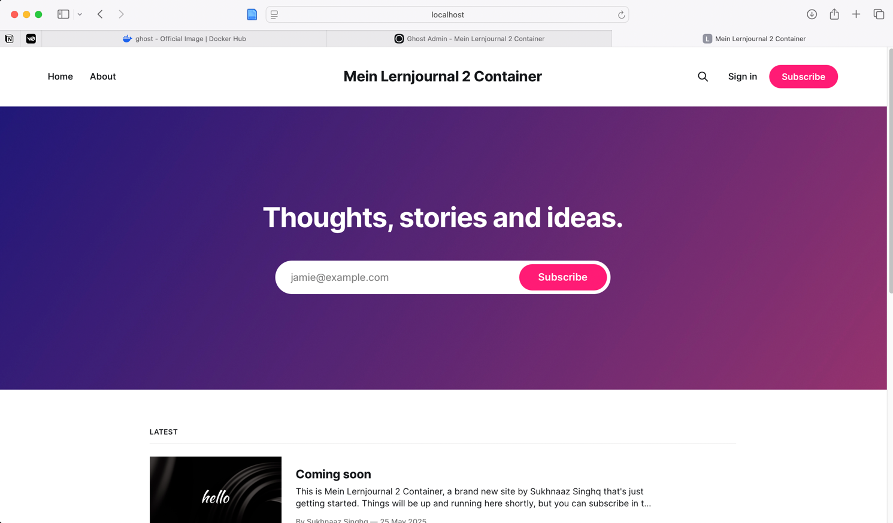

#### Ghost Admin-Oberfläche
Die Admin-Seite ist unter http://localhost:8080/ghost erreichbar.
Dort lassen sich Beiträge erstellen, Seiten verwalten, das Design anpassen und Mitglieder hinzufügen.
Die Oberfläche ist übersichtlich und für Content-Management optimiert.
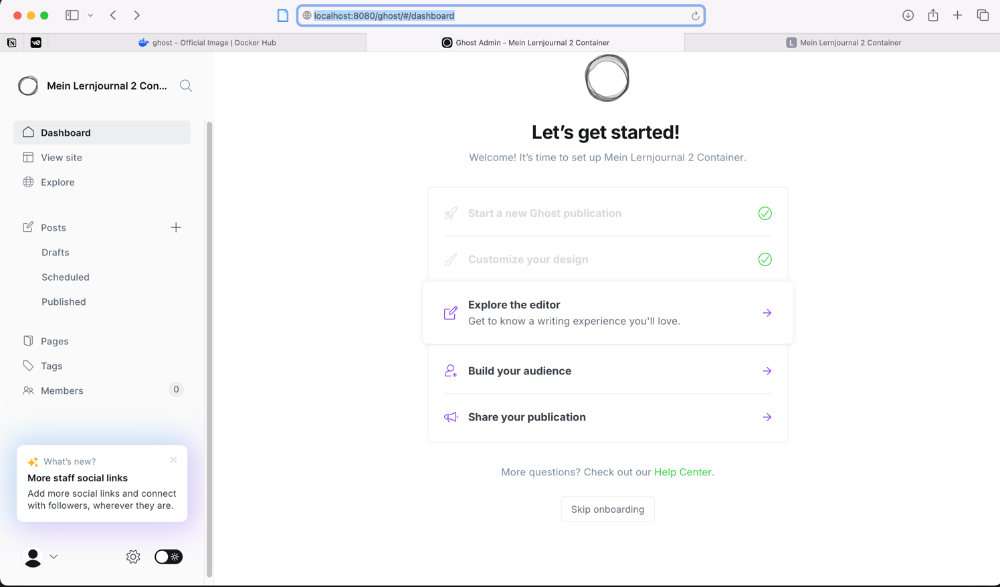

#### Blogpost erstellen
Hier sieht man die Maske zum Erstellen eines ersten Blogposts.
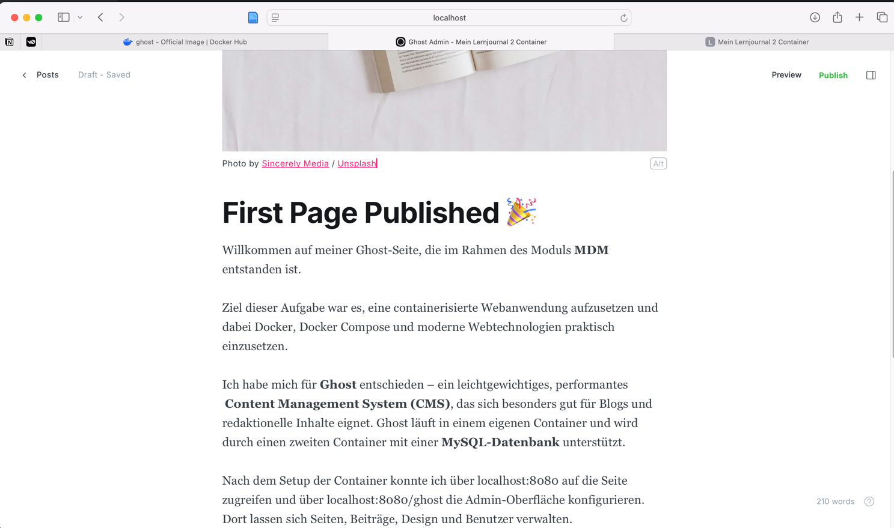

Dieser Inhalt wird im Volume `db:/var/lib/mysql` persistiert gespeichert.

---

### Dokumentation Docker-Compose Deployment

Zur Automatisierung wurde ein Compose-File verwendet:

```yaml
services:
  ghost:
    image: ghost:5-alpine
    restart: always
    ports:
      - 8080:2368
    environment:
      database__client: mysql
      database__connection__host: db
      database__connection__user: root
      database__connection__password: example
      database__connection__database: ghost
      url: http://localhost:8080
    volumes:
      - ghost:/var/lib/ghost/content

  db:
    image: mysql:8.0
    restart: always
    environment:
      MYSQL_ROOT_PASSWORD: example
    volumes:
      - db:/var/lib/mysql

volumes:
  ghost:
  db:
```

**Durchführung:**

1. `docker-compose.yml` im Projektverzeichnis gespeichert
2. Start über folgenden Befehl:

   ```bash
   docker compose up -d
   ```

3. Zugriff erneut über:  
   - Webseite: `http://localhost:8080`
   - Admin-UI: `http://localhost:8080/ghost`

4. Inhalte und Konfiguration wie im manuellen Setup
5. Volumes getestet (Daten bleiben nach Neustart erhalten)

---

### Fazit

- Die Containerisierung mit Ghost und MySQL funktioniert lokal einwandfrei
- Das manuelle und automatisierte Deployment wurde erfolgreich durchgeführt
- Docker Compose erleichtert die Wiederverwendbarkeit und Wartbarkeit
- Inhalte, Themes und Einstellungen sind nach Re-Deployments dank Volumes persistent


---

# Deployment ML-App

### Variante und Repository

| Gewähltes Beispiel           | Bitte ausfüllen                                                |
|-----------------------------|----------------------------------------------------------------|
| onnx-sentiment-analysis     | Nein                                                           |
| onnx-image-classification   | Ja                                                             |
| Repo URL Fork               | https://github.com/sukhnaazsingh/onnx-image-classification.git |
| Docker Hub URL              | URL                                                            |

---

### Dokumentation lokales Deployment
URL: onnx-image-classification-awa.azurewebsites.net

Hier wird der zweite teil des Lernjournal 2 behandelt. Ich habe mich für das Beispiel onnx-image-classification entschieden.
Dabei bin ich wie folgt vorgegangen. 
1. Fork https://github.com/mosazhaw/onnx-image-classification erstellt
2. Mit dem Fork einen lokalen Clone erstellt
3. alle notwendigen requirements/dpeendencies heruntergeladen
   ```bash
   pip install -r requirements.txt
   ```
4. Das Docker build ausgeführt (Lokaler Build des Containers mit Dockerfile/Lokales Deployment mit Docker)
   ```bash
   docker build -t onnx-image-classification .
   docker run --name onnx-image-classification -p 9000:5000 -d onnx-image-classification
   ```
   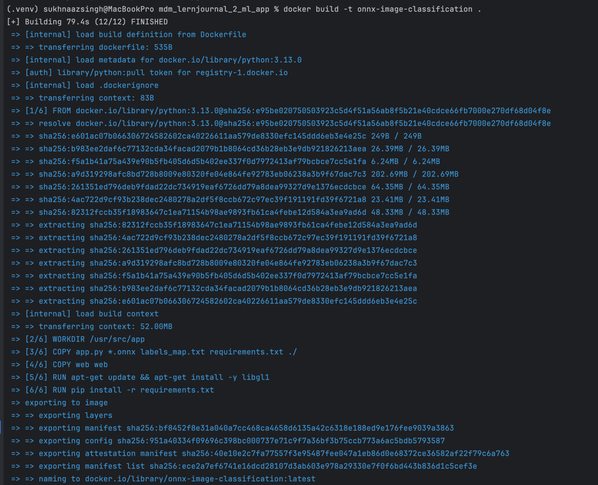
   
5. Das Docker Image wurde erstellt. (Lokales Deployment mit Docker)
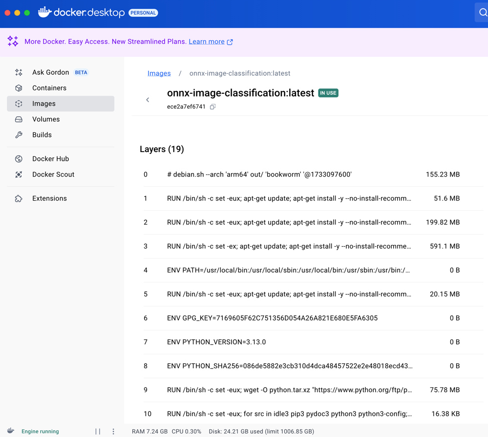
6. Das Model läuft auf http://localhost:9000 und kann getested werden
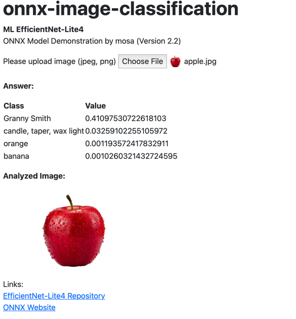
---
7. Nun wollen wir das Image auf DockerHub pushen, damit wir später das Image in Azure deployen können.
als erstest Tagen wir unser Image mit 'latest'
   ```bash
   docker tag onnx-image-classification sukhnaazsingh/onnx-image-classification:latest
   ```
   

danach wird das Image gepusht und es ist auf DockerHub ersichtlich

   ```bash
   docker push sukhnaazsingh/onnx-image-classification:latest.
   ```
   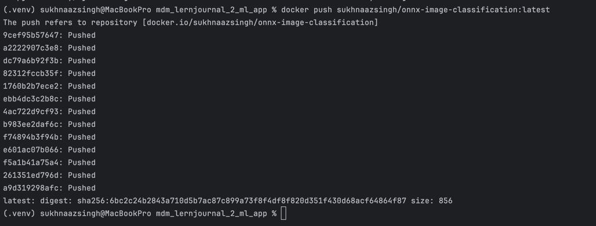
   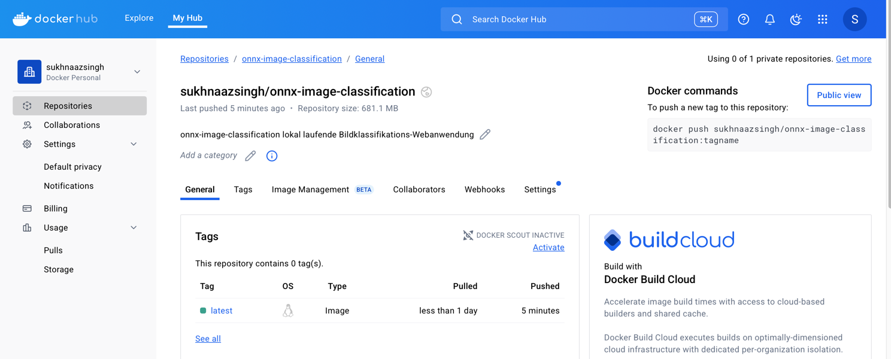

### Dokumentation Deployment Azure Web App
Im Vorfeld habe ich mich schon mal bei azure mit /az login/ angemeldet.

1. Eine Ressourcengruppe muss erstellt werden
   ```bash
   az group create --name mdm-lernjournal-2-awa --location switzerlandnorth
   ```

2. App Service Plan erstellen
   ```bash
   az appservice plan create --name mdm-lernjournal-2-awa-plan --resource-group mdm-lernjournal-2-awa --sku F1 --is-linux
   ```
   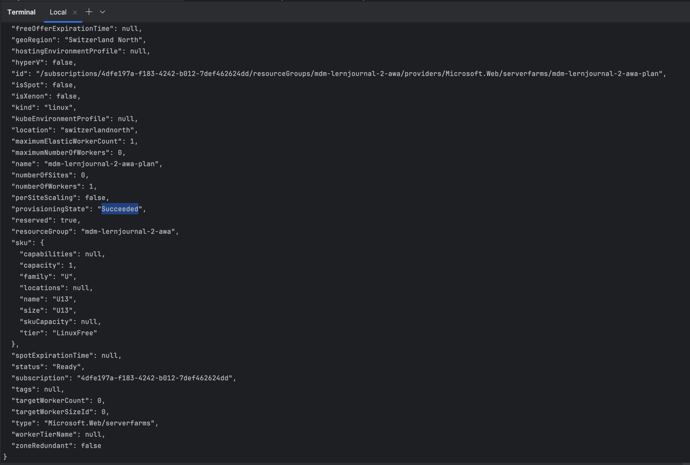
3. App erstellen
   ```bash
   az webapp create --resource-group mdm-lernjournal-2-awa --plan mdm-lernjournal-2-awa-plan --name onnx-image-classification-awa --container-image sukhnaazsingh/onnx-image-classification:latest
   ``` 
   die notwendigen Komponeten wurden erstellt, die Seite ist auf onnx-image-classification-awa.azurewebsites.net deployt.
   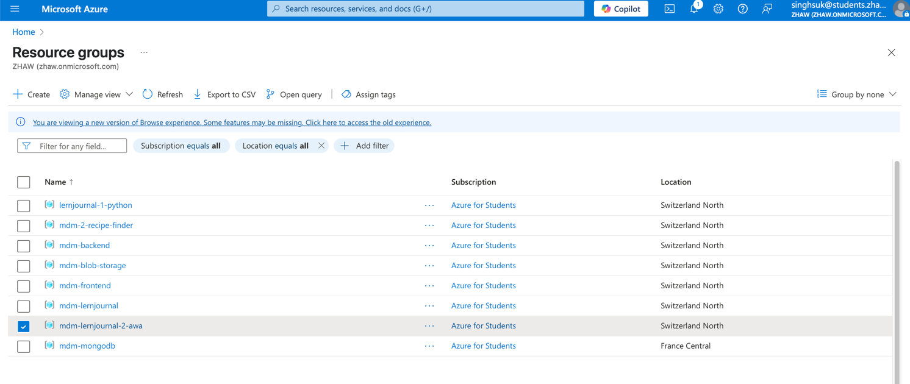
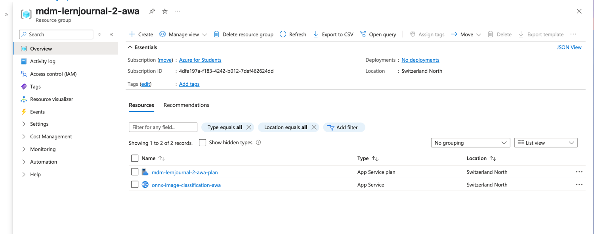
### Dokumentation Deployment ACA
1.
   ```bash
   az group create --location switzerlandnorth --name mdm-lernjournal-2-aca
   ``` 
   
2. 
   ```bash
   az containerapp env create --name mdm-2-onnx-image-classification-env --resource-group mdm-lernjournal-2-aca --location westeurope
   ```
   (inkl. Troubleshooting)
   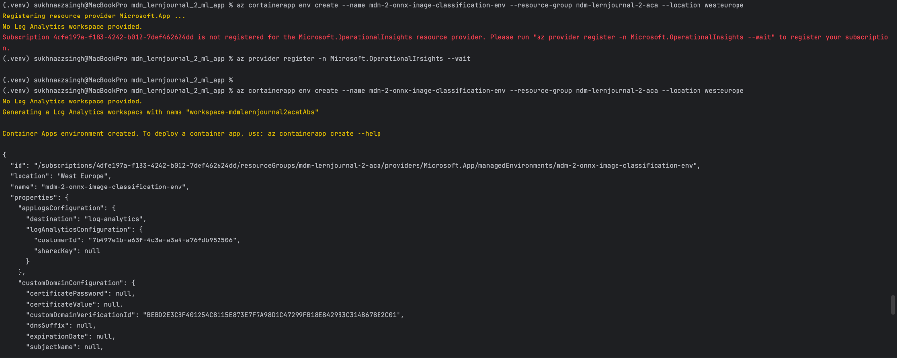
3.   
   ```bash
      az containerapp create \
     --name mdm-2-onnx-image-classification \
     --resource-group mdm-lernjournal-2-aca \
     --environment mdm-2-onnx-image-classification-env \
     --image sukhnaazsingh/onnx-image-classification:latest \
     --target-port 5000 \
     --ingress external \
     --query properties.configuration.ingress.fqdn
      ```
   

Die Seite ist live unter: https://mdm-2-onnx-image-classification.nicehill-7a13db7f.westeurope.azurecontainerapps.io
Somit war auch hier das deployment successfull.
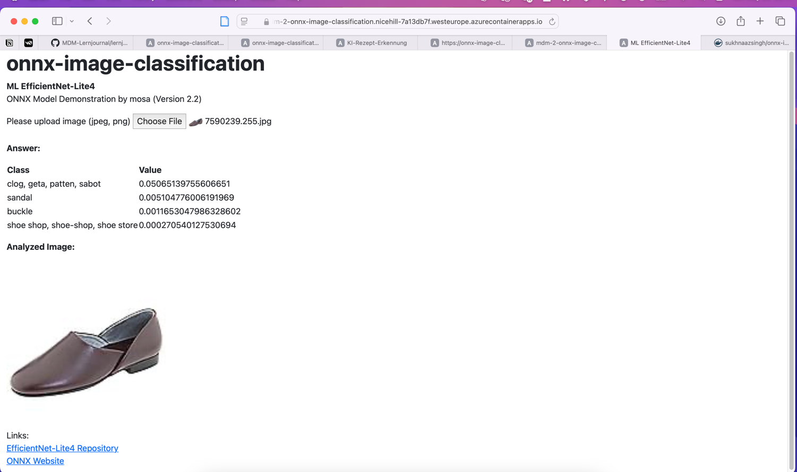

### Dokumentation Deployment ACI

   ```bash
   az group create --location switzerlandnorth --name mdm-lernjournal-2-aci
   ```


   ```bash
    az container create --resource-group mdm-lernjournal-2-aci --name mdm-2-aci-onnx-image-classification --image sukhnaazsingh/onnx-image-classification:latest --dns-name-label onnx-image-classification --ports 5000
   ```

Beim ACI hat ich Probleme beim deployen, ich habe es innerhalb 5 Stunden mehrmals probiert, aber es schien ein Problem zu geben bei DockerHub


Dann habe ich ChatGPT Um Rat gefragt, dort war auch die Rückmeldung, dass vermutlich gerade irgentein System nicht funktioniert und wenn nach mehrmaligen warten es nicht klappt ich diese Variant ausprobieren kann.
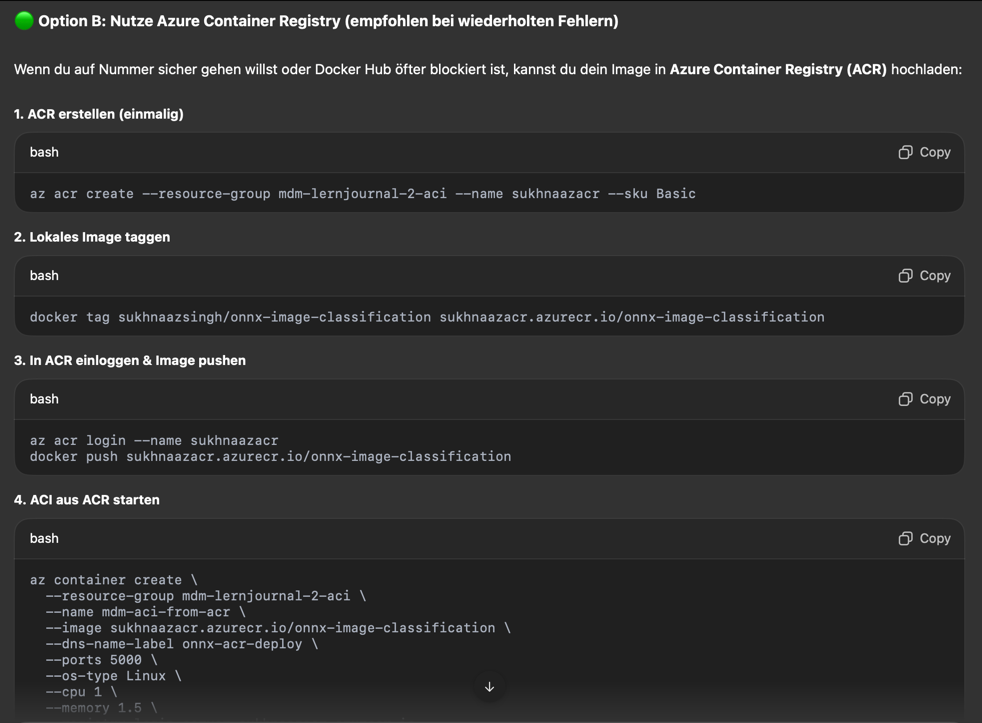

Das war noch eine Notification in Azure


Beim Versuch, mein öffentliches Docker-Image direkt mit Azure Container Instances (ACI) zu starten, kam es zu einem Fehler beim Zugriff auf Docker Hub. Um dieses Problem zu umgehen, habe ich das Image in eine Azure Container Registry (ACR) hochgeladen, da diese zuverlässiger und ohne Rate-Limiting funktioniert. 

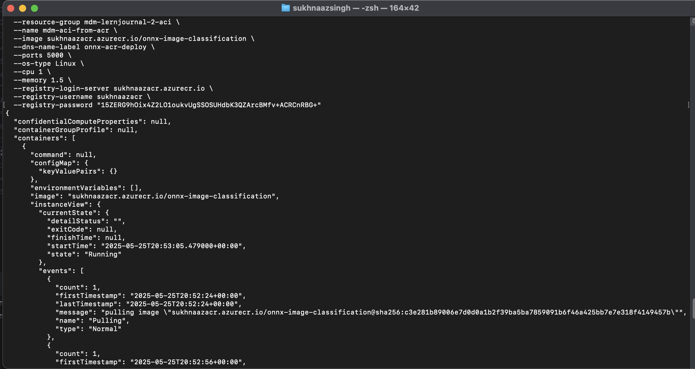
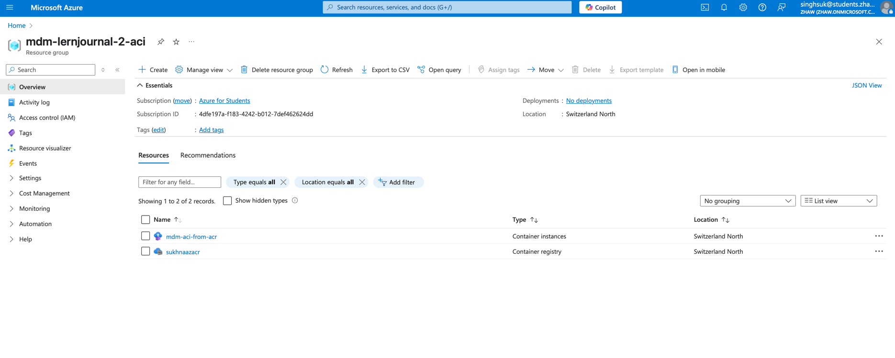