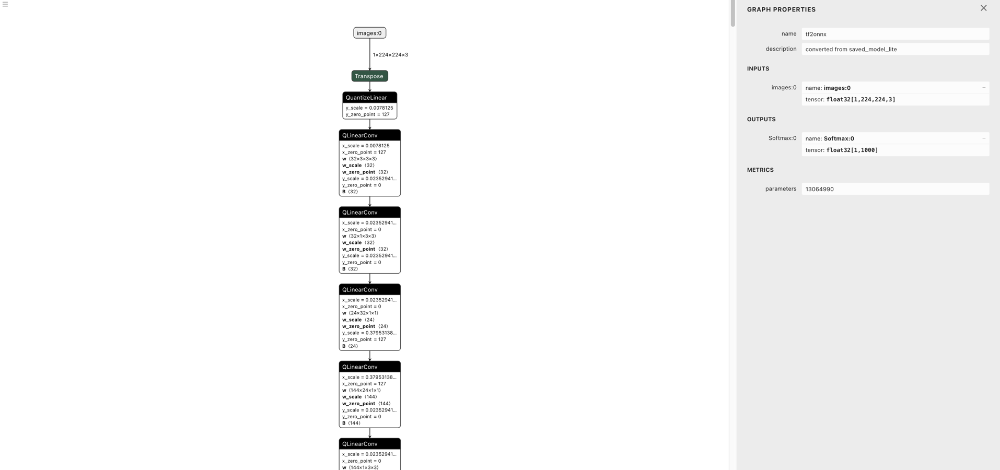
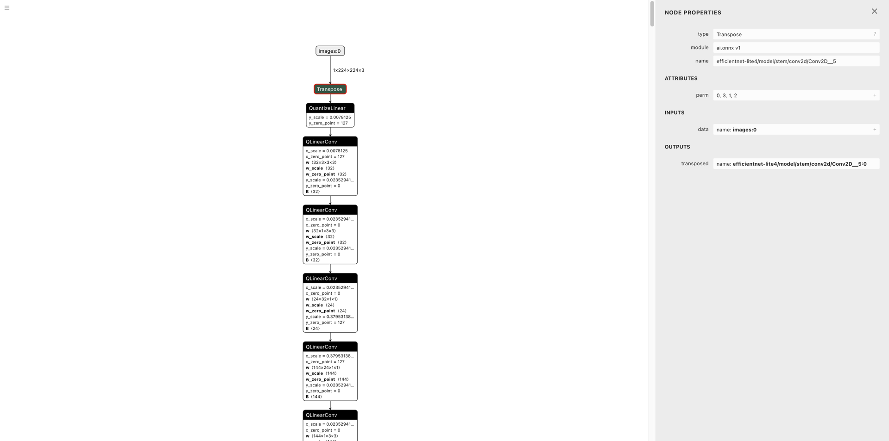

# Lernjournal 3 ONNX

## Übersicht

| | Bitte ausfüllen |
| -------- | ------- |
| ONNX Modell für Analyse (Netron) | https://github.com/onnx/models/blob/main/validated/vision/classification/efficientnet-lite4/model/efficientnet-lite4-11-int8.tar.gz |
| onnx-image-classification Fork (EfficientNet-Lite) | URL |

## Dokumentation ONNX Analyse

Die Abbildung zeigt die graphische Darstellung eines quantisierten neuronalen Netzes im ONNX-Format (Open Neural Network Exchange). Es handelt sich dabei um ein Convolutional Neural Network (CNN), das für die Bildklassifikation optimiert wurde.

Das Netzwerk erwartet ein Eingabebild mit der Form 1×224×224×3, was einem RGB-Bild mit einer Höhe und Breite von 224 Pixeln entspricht. Direkt zu Beginn erfolgt eine Transpose-Operation, bei der die Dimensionen des Bildes umgeordnet werden. Der ursprüngliche Aufbau im NHWC-Format (Batch, Height, Width, Channels) wird mittels perm = [0, 3, 1, 2] in das NCHW-Format transformiert, das in vielen Frameworks effizienter verarbeitet werden kann. Die Ausgabe dieser Schicht hat entsprechend die Form 1×3×224×224.

Nach mehreren Faltungsschichten und Feature-Extraktionen erfolgt gegen Ende des Modells ein QLinearAveragePool, der die räumliche Auflösung der Feature Maps reduziert und als Übergang zur Klassifikation dient. Die folgende Squeeze-Schicht entfernt unnötige Dimensionen mit der Länge 1, sodass die Tensorform von 1×1280×1×1 zu 1×1280 vereinfacht wird.

Am Ende des quantisierten EfficientNet-Lite4-Modells wird eine Softmax-Schicht angewendet. Diese berechnet aus den vorangegangenen, dequantisierten Werten (Logits) eine Wahrscheinlichkeitsverteilung über alle möglichen Klassen. Die Softmax-Funktion sorgt dafür, dass alle Ausgabewerte zwischen 0 und 1 liegen und ihre Summe 1 ergibt. Damit wird sichergestellt, dass die Modellvorhersage als Wahrscheinlichkeiten interpretiert werden kann. In diesem Fall liefert das Modell eine 1×1000-Ausgabe, passend zur Anzahl der ImageNet-Klassen. Die Klasse mit dem höchsten Wahrscheinlichkeitswert gilt dabei als Vorhersage des Netzwerks.

## Dokumentation onnx-image-classification

* [ ] TODO