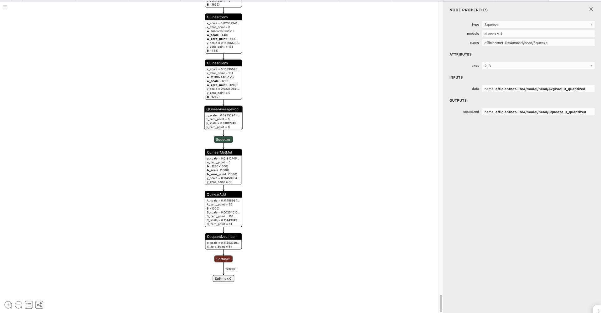
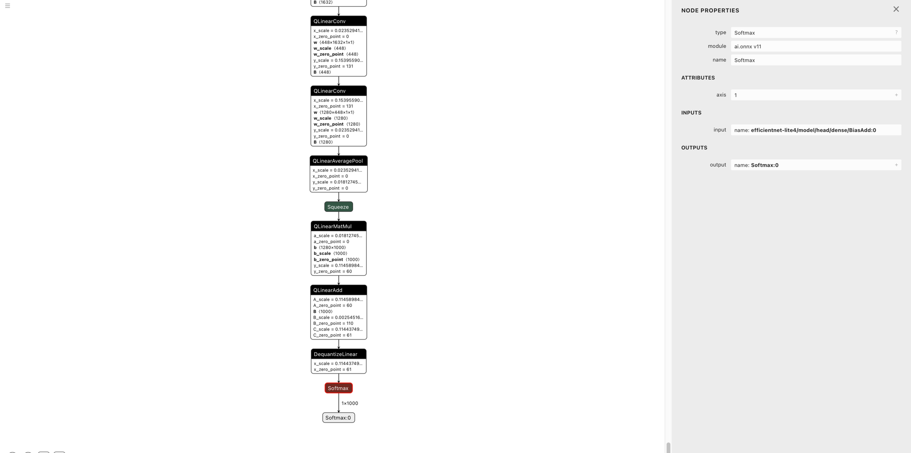
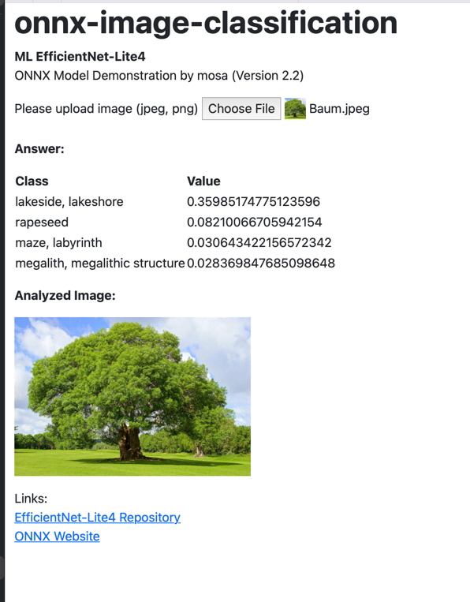
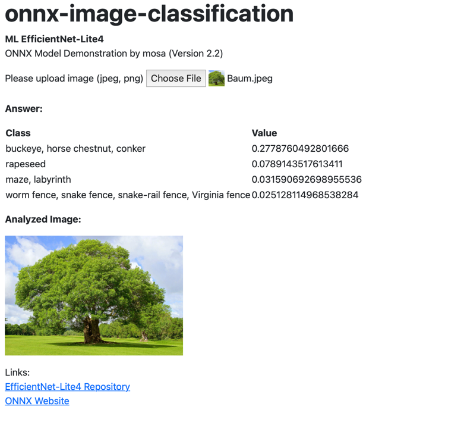

# Lernjournal 3 – ONNX

## Übersicht

| | Inhalt |
| -------- | ------- |
| ONNX Modell für Analyse (Netron) | [EfficientNet-Lite4-INT8 (ONNX Model Zoo)](https://github.com/onnx/models/blob/main/validated/vision/classification/efficientnet-lite4/model/efficientnet-lite4-11-int8.tar.gz) |
| onnx-image-classification Fork (EfficientNet-Lite) | https://github.com/sukhnaazsingh/onnx-image-classification.git |

---

## Dokumentation: ONNX-Modellanalyse

Die folgende Analyse bezieht sich auf das Modell **EfficientNet-Lite4-INT8**, ein quantisiertes neuronales Netz im ONNX-Format, das speziell für effiziente Bildklassifikation auf ressourcenlimitierten Systemen (z. B. Mobilgeräten) optimiert wurde.

Das Modell erwartet ein Eingabebild mit der Dimension `1×224×224×3`, was einem RGB-Bild mit einer Höhe und Breite von 224 Pixeln entspricht. Direkt zu Beginn des Modells erfolgt eine **Transpose-Operation**, die das Eingabeformat vom typischen NHWC-Layout (Batch, Height, Width, Channels) in das von ONNX bevorzugte NCHW-Layout (Batch, Channels, Height, Width) umwandelt. Dies geschieht mittels der Permutation `[0, 3, 1, 2]`, sodass die Eingabeform nun `1×3×224×224` beträgt.

Nach mehreren aufeinanderfolgenden Faltungsschichten (QLinearConv) erfolgt eine **QLinearAveragePool-Operation**, die die räumliche Auflösung der Feature Maps reduziert. Anschliessend entfernt eine **Squeeze-Schicht** redundante Dimensionen mit der Länge 1, was den Tensor von `1×1280×1×1` auf `1×1280` vereinfacht.

In der finalen Phase des Modells wird über eine quantisierte Matrixmultiplikation (`QLinearMatMul`) sowie einen Additionsschritt (`QLinearAdd`) eine Ausgabe von 1.000 Rohwerten erzeugt. Diese werden mittels **DequantizeLinear** zurück in Gleitkommazahlen konvertiert und schliesslich durch die **Softmax-Funktion** in Wahrscheinlichkeiten umgerechnet. Das Ergebnis ist ein Vektor mit 1.000 Elementen, wobei der höchste Wert die vom Modell vorhergesagte Klasse repräsentiert.

---

## Dokumentation: onnx-image-classification (EfficientNet-Lite)

Im Rahmen des Projekts wurde die Webanwendung `onnx-image-classification` geforkt und das ursprüngliche Modell durch das quantisierte Modell **EfficientNet-Lite4-INT8** ersetzt. Ziel war es, die Klassifikationsergebnisse zwischen Original- und komprimiertem Modell zu vergleichen.

| Bild  | Modell                 | Top-1 Prediction                       | Confidence |
|-------|------------------------|----------------------------------------|------------|
| Berg  | EfficientNet-Lite4     | valley, vale                           | 0.00027636 |
| Berg  | EfficientNet-Lite4 INT8| valley, vale                           | 0.00033173 |
| Baum  | EfficientNet-Lite4     | lakeside, lakeshore                    | 0.35985    |
| Baum  | EfficientNet-Lite4 INT8| buckeye, horse chestnut, conker        | 0.27788    |
| Blume | EfficientNet-Lite4     | bee                                    | 0.26348    |
| Blume | EfficientNet-Lite4 INT8| bee                                    | 0.24409    |

Die Ergebnisse zeigen, dass das INT8-Modell trotz seiner deutlich geringeren Grösse (13 MB statt 51 MB) in den meisten Fällen sehr ähnliche Vorhersagen liefert. Bei den Bildern "Berg" und "Blume" stimmen die erkannten Klassen vollständig überein – lediglich die Konfidenzwerte unterscheiden sich leicht. Beim Bild "Baum" unterscheiden sich die Klassifikationen zwar, aber beide Ergebnisse sind plausibel, was auf die inhärente Unsicherheit im Klassifikationsprozess hinweist.

Insgesamt lässt sich feststellen, dass das quantisierte Modell **eine gute Balance zwischen Modellgrösse und Genauigkeit** bietet. Es eignet sich daher besonders für Anwendungen, bei denen Speicher- und Rechenressourcen limitiert sind.

---

### Beispiel: Bildanalyse Baum

- **Originalmodell (EfficientNet-Lite4):**  
  

- **Quantisiertes Modell (EfficientNet-Lite4-INT8):**  
  

