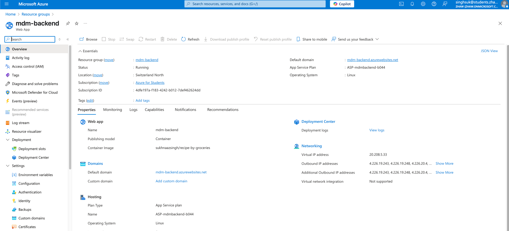

# Projekt 1 Python

## Übersicht

| | Ausgefüllt |
| -------- | ------- |
| Variante | Eigenes Projekt |
| Datenherkunft | Format: HTML (Webscraping), JSON (interne Verarbeitung) |
| Datenherkunft | Die Daten stammen von https://www.autoscout24.ch/de/s (Details im Scraper), sie werden automatisiert gescraped. |
| ML-Algorithmus | Lineare Regression, Modellvergleich & Bestmodell-Marking |
| Repo URL | https://github.com/sukhnaazsingh/mdm_p1_car_price_estimator.git |

## Dokumentation

### Data Scraping

Das Scraping erfolgt mit Selenium automatisiert mit einem **Docker-Container**, der via GitHub Actions (`scrape.yml`) ausgeführt wird.  
Dabei werden mit `chromium` Webseiten geöffnet und strukturiert ausgewertet. Die Daten werden in **MongoDB** gespeichert.  
**Environment Variablen**:  
- `MAX_SCRAPE_SIZE` begrenzt Umfang  
- `MONGODB_URI` speichert Ergebnisse  

👉 Siehe Workflow: `.github/workflows/scrape.yml`

#### Hinweise & Herausforderungen beim Scraping

Beim automatisierten Scraping über GitHub Actions kam es zu Problemen, da die Zielseite [autoscout24.ch](https://www.autoscout24.ch/) durch **Cloudflare geschützt** ist.  
Ein direkter Zugriff über GitHub-hosted Runner wurde dadurch blockiert.

**Lösung:**  
Ich habe einen **self-hosted GitHub Runner auf meiner lokalen Maschine** eingerichtet.  
Dadurch konnte die Scraping-Pipeline aus `scrape.yml` über meine Maschine ausgeführt werden.  
Die GitHub Action verbindet sich mit dem lokalen Runner und führt das Scraping erfolgreich in meiner Umgebung durch – inklusive Headless-Browser (Chromium) und Docker.

### Training

Das Training läuft ebenfalls automatisiert via GitHub Actions (`ml_ops.yml`) in zwei Stufen:
1. **Modelltraining**: Das Skript `model_price_estimation.py` trainiert verschiedene Modelle (u. a. lineare Regression).
2. **Modellbewertung**: Anschliessend wird mit `mark_best_model.py` das beste Modell identifiziert und in MongoDB vermerkt.

Verwendete Umgebung: `python:3.12-bookworm` Docker-Container mit Poetry-Paketverwaltung.  
Datenquelle: gescrapte Daten aus MongoDB.  
Ort: `src/mdm_p1_car_price_estimator/ml/`

### ModelOps Automation

Die gesamte MLOps-Pipeline ist in zwei unabhängige GitHub Actions aufgeteilt:
- `scrape.yml`: Scraping automatisiert (eventuell cronfähig)
- `ml_ops.yml`: Training & Bestmodell-Markierung

Zusätzlich existiert ein Deployment-Workflow (`app-deployments.yml`) zum **Bau & Push eines Docker-Images** in die **GitHub Container Registry (GHCR)**, für die spätere Auslieferung.

### Deployment

Deployment erfolgt via GitHub Action in `app-deployments.yml`.  
Das Docker-Image wird gebaut und automatisch in `docker.io/sukhnaazsingh/mdm-backend` gepusht.  
Später kann dieses Image auf Azure App Service deployed werden.

