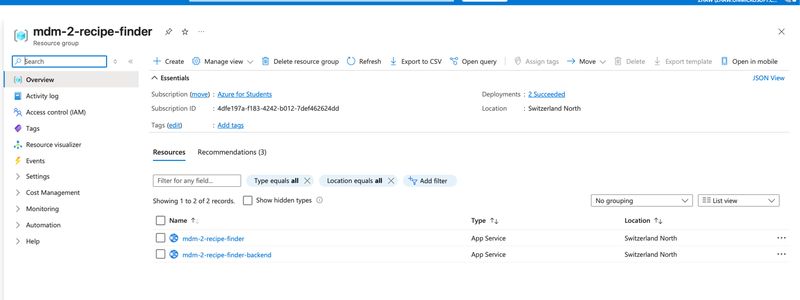
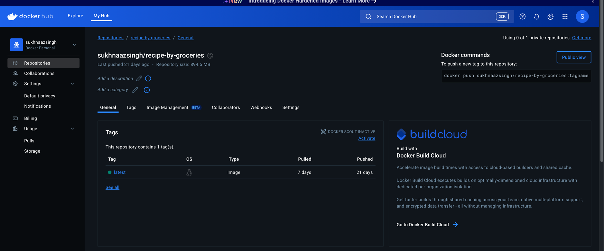

# Projekt 2 Java

## Übersicht

| | Bitte ausfüllen |
| -------- | ------- |
| Variante | Vorlesungsbeispiel/Vorhandenes Modell/Vorhandener Datensatz  |
| Datensatz (wenn selbstgewählt) | Format (HTML, XML, JSON, ...), Beschreibung |
| Datensatz (wenn selbstgewählt) | URL |
| Modell (wenn selbstgewählt) | URL |
| ML-Algorithmus | Bezeichnung |
| Repo URL | URL |

## Dokumentation
Im Rahmen dieses Projekts wurde ein Java App entwickelt, der auf Basis eines hochgeladenen Lebensmittelfotos erkennt, welche Zutaten darauf zu sehen sind, und darauf basierend passende Rezepte vorschlägt. Der zugrunde liegende Datensatz enthält rund 30 Lebensmittelklassen wie beispielsweise Tomate oder Gurke. 

### Daten
https://www.kaggle.com/datasets/dansbecker/food-101/data
https://www.kaggle.com/datasets/bhavikjikadara/grocery-store-dataset

- Datensatz mit ca. 30 Lebensmittelklassen (z.B. Tomate, Gurke, etc.)
- Eigenes Labeling
- Format: einfache Bilddateien
- Herausforderung: schlechte Modellperformance bei Training auf Apple Silicon (M1/M2)

### Training

- Framework: DJL (Deep Java Library)
- Basis-Modell: ResNet-18
- Probleme beim Training auf Apple M1 Chip:
  - Schlechte Konvergenz
  - Auch bei Reduktion auf 3 Klassen wurden Lebensmittel nicht korrekt erkannt
  - Lösung: Umstellung der Trainingsumgebung empfohlen (z. B. via Google Colab oder Linux VM)

### Inference / Serving

Das Training erfolgte mit der Deep Java Library (DJL) unter Verwendung eines vortrainierten ResNet-18-Modells. Für die Inferenz wurde ein Service namens GroceryRecognizerService implementiert, der Bilder klassifiziert und die erkannten Lebensmittel extrahiert. Diese Ergebnisse werden über den GroceryRecognizerController an das Frontend übermittelt. Dort prüft das System, ob bereits ein passendes Rezept mit den erkannten Zutaten existiert. Wird ein solches gefunden, wird es direkt dargestellt. Sollte kein passendes Rezept vorhanden sein, werden die erkannten Zutaten an ChatGPT übergeben. ChatGPT generiert daraufhin ein neues Rezept, das im Backend über den RecipeGeneratorService verarbeitet, in einer MongoDB gespeichert und dem User zur Verfügung gestellt wird.

- **Service:** `RecipeService`
- **Repository:** `RecipeRepository`
- Falls ein passendes Rezept existiert → wird dargestellt
- Falls **kein passendes Rezept existiert**:
  - Zutatenliste wird an **ChatGPT** geschickt
  - Rezept wird von ChatGPT generiert und ans Backend zurückgesendet
  - Rezept wird in MongoDB gespeichert
  - Danach dem User präsentiert

- **Rezept-Generierung:** `RecipeGeneratorService`

### Deployment

- Maven-Projekt
- Dockerfile vorhanden
- Deployment mittels Docker Image in Azure

Hier sieht man die deployed Webseite 
  

Die Ressourcen in Azure

Das Docker Image auf DockerHub

---

## Features

- 📸 Bildbasierte Erkennung von Lebensmitteln
- 🍝 Rezeptvorschläge aus Datenbank oder via ChatGPT
- 🧠 Automatische Speicherung neu generierter Rezepte
- 🔍 Rezeptübersicht mit Filterfunktionen im Frontend

---

## Probleme & Learnings

Während der Entwicklung gab es grosse Schwierigkeiten mit dem Modelltraining mithilfe von DJL auf einem Apple M1 Chip. Die Ergebnisse der Bildklassifikation waren durchgehend ungenau und nicht brauchbar. Ich habe verschiedenste Kombinationen ausprobiert, um die Vorhersagequalität zu verbessern: Ich habe die Anzahl der Epochen erhöht und verringert, die Anzahl der Klassen reduziert – zum Beispiel von 30 auf nur noch 3 –, und sämtliche Einstellungen in unterschiedlichen Varianten kombiniert. Trotz all dieser Versuche hat sich die Modellperformance nicht verbessert. Er hat nach jedem Training einfach für jedes Bild immer nur eine Klasse genannt und das auch mit 99% Sicherheit. Nach intensiver Recherche bin ich auf mehrere Hinweise gestossen, dass das Training auf Apple Silicon, insbesondere auf M1-Chips, zu fehlerhaftem Verhalten führen kann. Es scheint, als ob die Hardware bzw. das Zusammenspiel mit DJL nicht für stabile Trainingsergebnisse geeignet ist.

Jedoch Mitstudierende die ebenfalls einen Apple-Silicon Chip haben, haben nicht die gleichen Probleme wie ich erfahren, daher bin ich etwas ratlos geblieben.

https://github.com/deepjavalibrary/djl/issues/2323?utm_source=chatgpt.com

https://djl.ai/docs/development/setup.html?utm_source=chatgpt.com